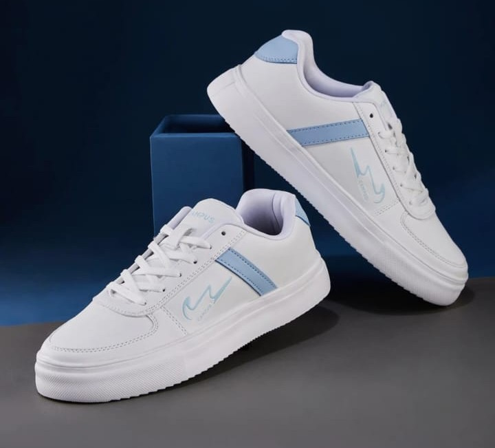

<!DOCTYPE html>
<html>
<head>
  <title>Beauty Shoe Center</title>
  <meta name="viewport" content="width=device-width, initial-scale=1">
  
</head>

<body>

<header>
  <h1>Beauty Shoe Center</h1>
  
Your Style, Our Shoes

</header>

<section>
  <h2>About Us</h2>
  

    Beauty Shoe Center is a trusted shoe shop offering stylish, comfortable,
    and affordable footwear for all ages.
  

</section>

<section>
  <h2>Our Services</h2>
  <ul>
    <li>Latest shoe collections</li>
    <li>Affordable prices</li>
    <li>Customer-friendly service</li>
    <li>Quality footwear</li>
  </ul>
</section>

<section>
  <h2>Our Products</h2>
  <ul>
    <li>Men Shoes</li>
    <li>Women Shoes</li>
    <li>Kids Shoes</li>
    <li>Sandals & Slippers</li>
  </ul>
</section>

<section>
  <h2>Contact Us</h2>
  
<b>Shop Name:</b> Beauty Shoe Center

  
<b>Phone:</b> 9XXXXXXXXX

  
<b>Address:</b> Your Shop Address Here

</section>

<footer>
  
© 2026 Beauty Shoe Center

</footer>

</body>
</html>

